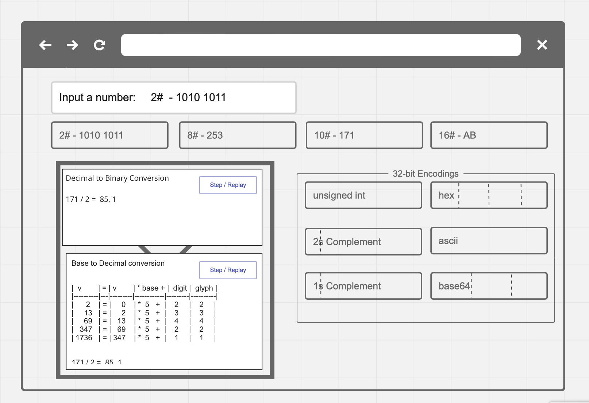

# A Web Application to Convert and Encode Integers
An academic tool used to Convert and Encode Integers (of various bases)

This project is currently being designed.

Website: https://www.csun.edu/~steve/classes/integers-conversion-encoding/index.html#integer

